# EventSync

**EventSync** is a collaborative event management app designed to streamline the process of planning, organizing, and executing events. The app emphasizes team coordination by enabling communication and task delegation among event committee members.

---

## Features

- **Real-time Messaging**  
  Enables members to communicate instantly within event-specific rooms.

- **Role-Based Access Control**  
  Admins can assign roles, and manage members; regular users have limited permissions.

- **Room-Based Organization**  
  Each event is structured as a separate room with its own chat, task list, and participants.

- **Firebase Realtime Database Integration**  
  All updates (messages, tasks, member roles) are synced in real time across users and devices.

---

## Tech Stack

- **Android Studio (Java)** – Mobile app development platform  
- **Firebase Realtime Database** – Cloud-based backend for storing and syncing data

---

## Screenshots

### Login Screen
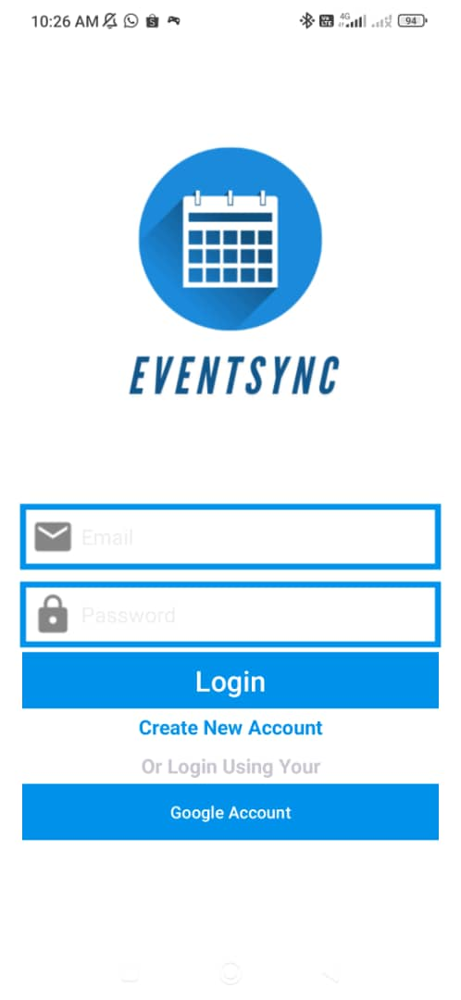

---

### Dashboard
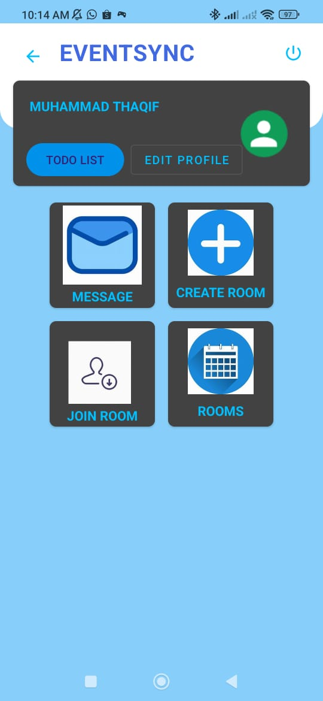

---

### User's To-Do List


---

### Room Creation
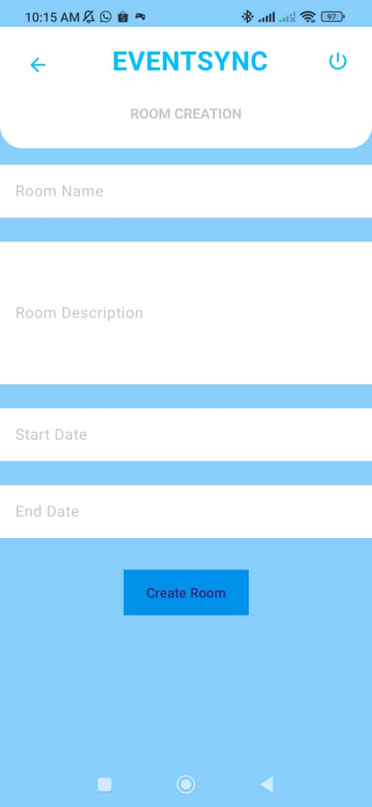

---

### Room List
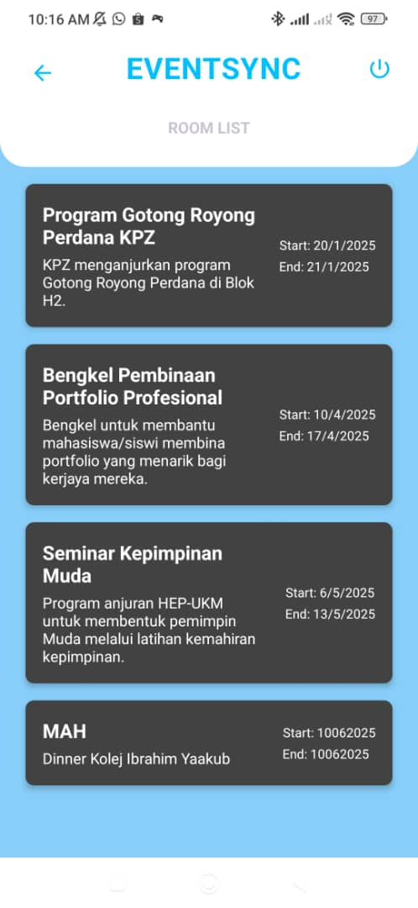

---

### Room Dashboard
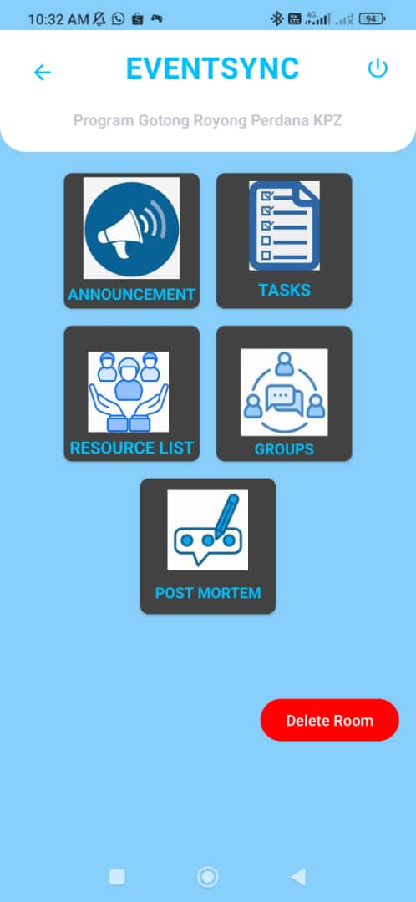

---

### Room Task List
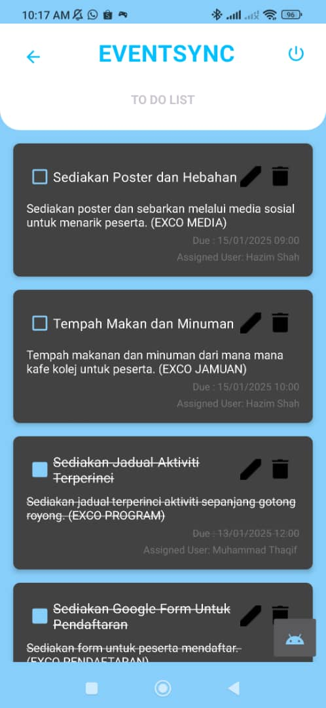

---

### Resources Section
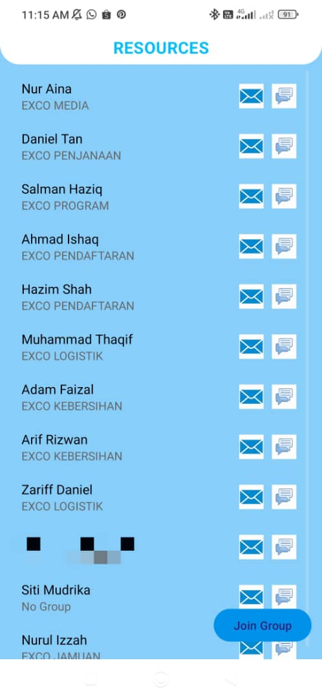

---

### Group List
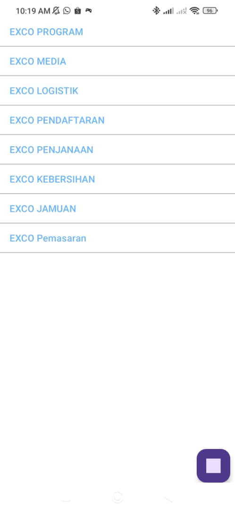

---

### Group Chat Interface
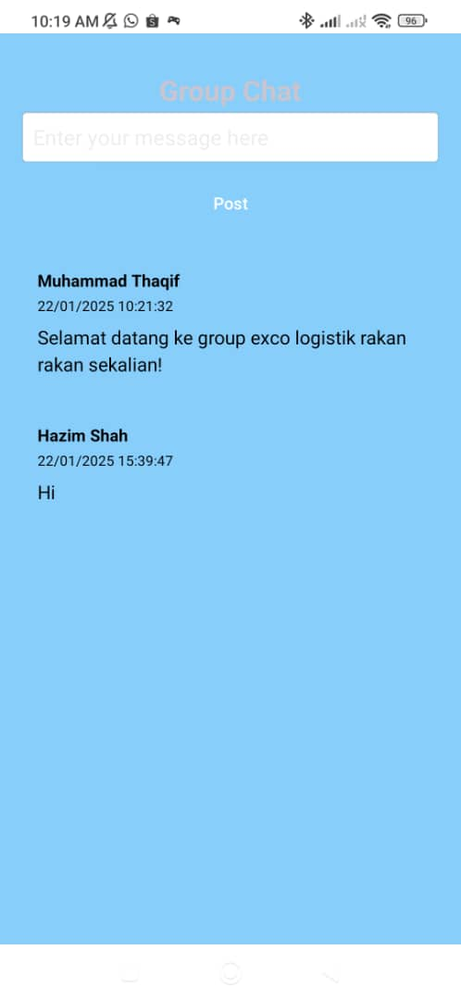

---

### Announcement Section
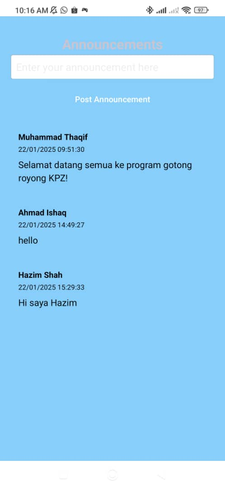

---

### Messaging Module
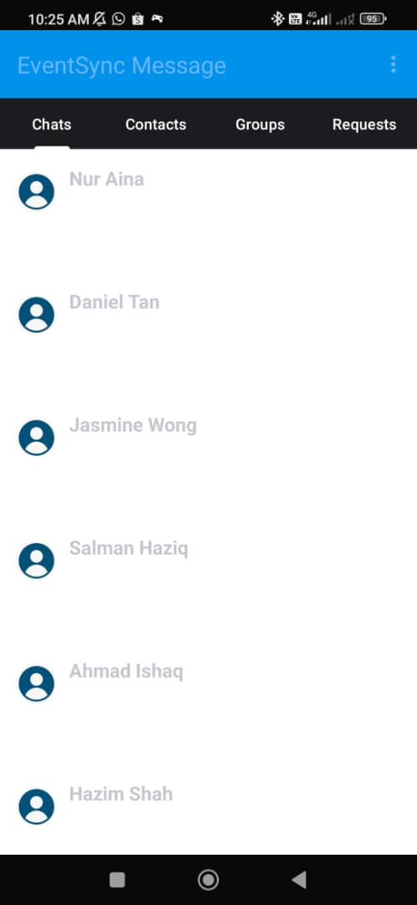

---

### Real-Time Messaging
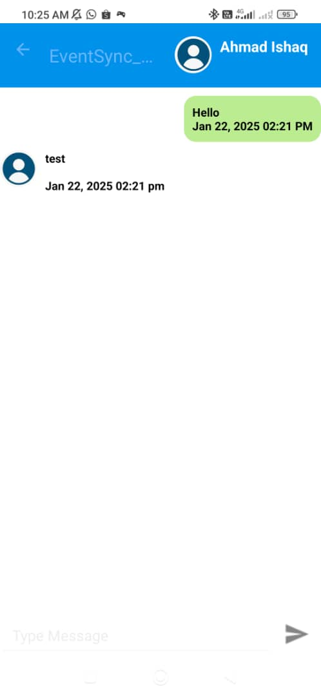

---

## APK Download

Download the apk and test it on an Android mobile device, you’ll be able to download it here:

[Download APK](https://github.com/thaqifbrutus/EventSync/releases/tag/v1.0)

---

## Getting Started

To run this app locally for development:

1. **Clone the repository**
   ```bash
   git clone https://github.com/thaqifbrutus/EventSync.git

2. **Open in Android Studio**
3. **Set up Firebase**
     a. Create Firebase Project
     b. Enable Firebase Realtime Database
     c. Download google-services.json and place it in the /app directory
4. **Run app on emulator or device**

---

## About the Project

EventSync is a mobile application built to address the challenges of organizing and managing events with multiple participants. Designed as a collaborative tool for event committees, the app integrates real-time communication and task delegation features to help teams stay aligned and organized throughout the planning and execution phases.

This project was developed as part of my learning journey in mobile app development using Android Studio and Firebase. While the application is functional, it is still in an early stage and may contain bugs or incomplete features. The current version serves as a foundation for further improvement and refinement.

As I continue to learn and gain experience, I plan to update this project by enhancing the user experience, fixing issues, and implementing more advanced functionalities. Feedback and suggestions are always welcome, and I am committed to continuously improving this application as a showcase of my technical growth.

